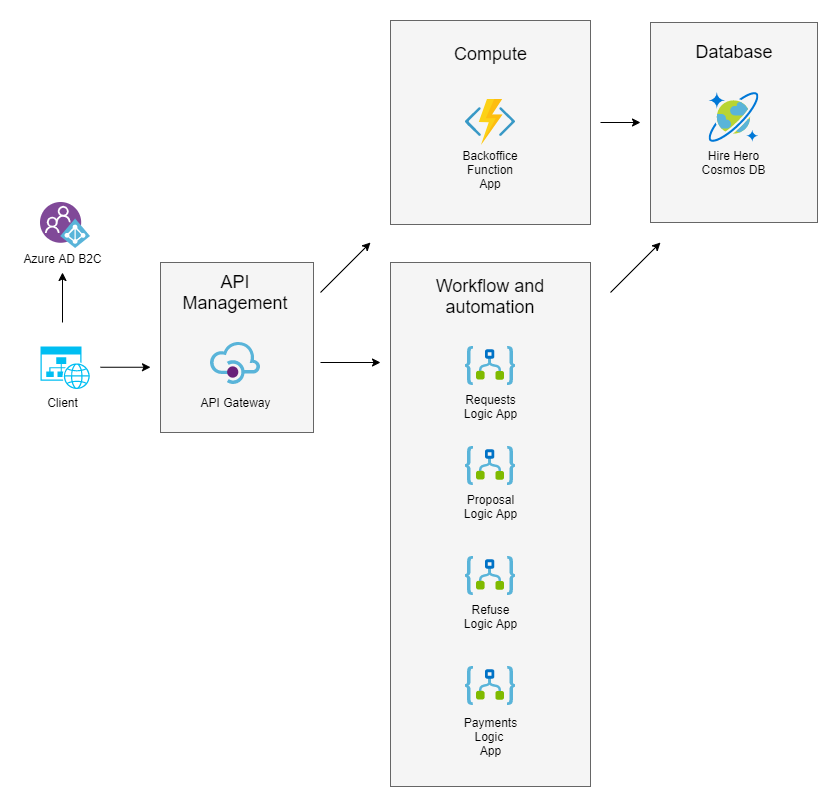

Hire hero company is a project which showcase simple implementation of Workflow process using low code approach. Whole concept of a project is to use as much of cloud native components as possible.

## The Plan
1. Implementation of basic workflow using Logic Apps
2. Usage of some compute power and serverless approach to fetch some data from Cosmos DB
3. Usage of highly scalable Cosmos DB database
4. Blazor Webassembly frontend hosted in Blob Storage or Static Web Apps

## Architecture
Below diagram shows high level overview of Azure architecture and used components.

## Getting started
[Deploy Infrastructure As A Code "ARM Template"]
[Required libraries]

## Components
[List of PaaS elements used and code]

## Known issues
[List of issues discovered during implementation or not implemented features]